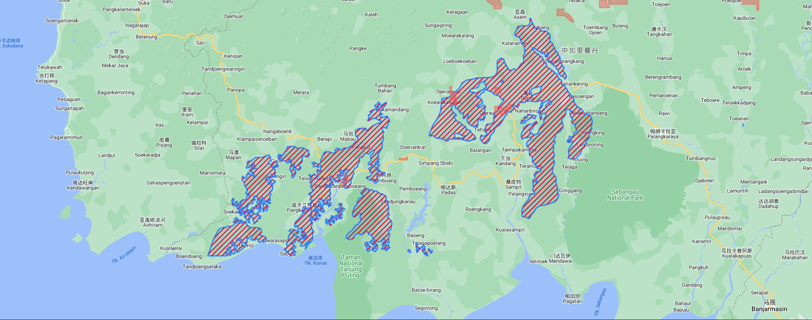

# leaflet-polygon-fillPattern-canvas

Extend the Polygon Object to fill canvas element with an image pattern.
Performance is better than svg rendering.
Can improve the rendering performance of big data.

### Usage example

```javascript
//<div id="map"></div>
//

var map = L.map("map", {
  preferCanvas: true,
}).setView([23.7, 121], 8);

var poly1 = [
  [24, 121],
  [24.5, 121],
  [25.5, 121],
  [25.5, 124],
  [24.5, 121.9],
  [24, 121.9],
];
L.polygon(poly1, { imgId: "lamp" }).addTo(map);
```


